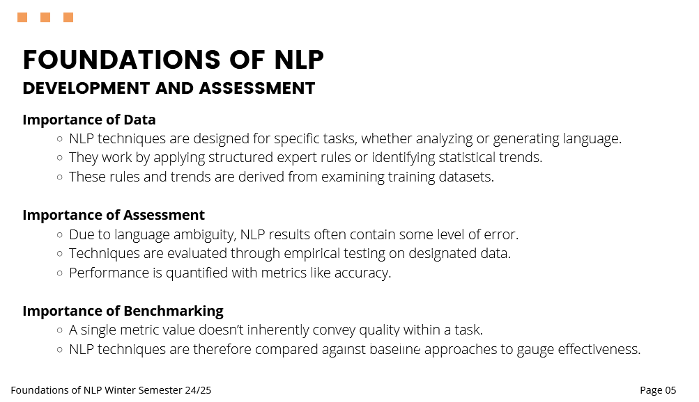
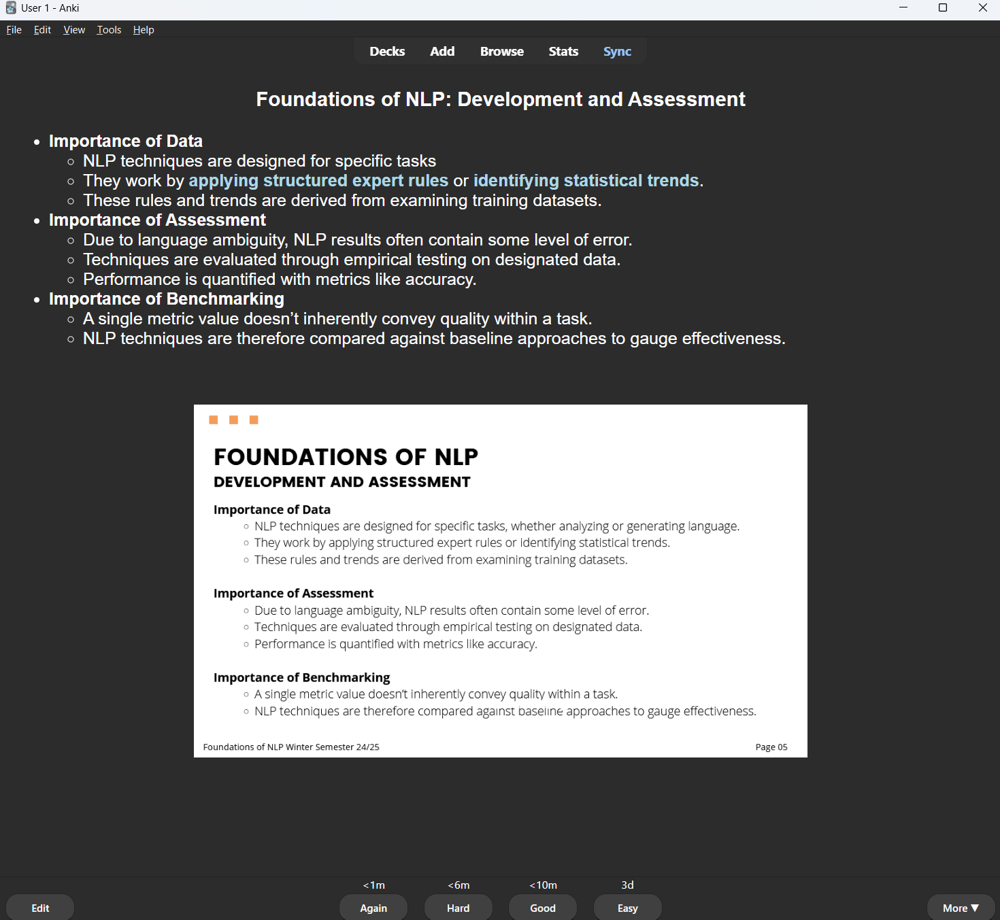

# Create Anki Flashcards from PDFs Using ChatGPT


This project automates the creation of Anki flashcards from PDF files,
transforming each page into HTML-formatted text with cloze deletions.
The resulting Anki deck is ready for direct import into [Anki](https://apps.ankiweb.net/),
making study materials more interactive and engaging.

To create Anki flashcards, I used [genanki](https://github.com/kerrickstaley/genanki) - a library for generating Anki decks.

## Motivation
I found that manually creating Anki flashcards by copying, formatting,
and editing text from PDF materials shared by professors was time-consuming. 
With this tool, I save time on these repetitive tasks, allowing me to focus more on actual learning.

Powerful GPT models are surprisingly affordable and can perform these tasks effectively,
turning dense and static PDFs into flashcards that support active recall—a proven, 
effective learning method. Using this tool, I can transform unengaging PDF pages like this:



...into engaging flashcards like this:



This way, I make systematic learning more enjoyable and effective in the long run.

## How to Use

1. **Prepare the PDF**: Save your input PDF file in the `pdf_files` directory.
2. **Create .env file**: Create `.env` file in the project root directory with your OpenAI API secret key. 
3. **Run the Script**: Execute the main script by running `main.py`:
   ```bash
   python main.py
   ```
4. **Find the Generated Deck**: After running, the resulting `*.apkg` file will be saved in the `generated_decks` directory with the same name as your PDF file.

### Importing the Created Deck

- Open Anki.
- Go to **File > Import** and select your `*.apkg` file from the `generated_decks` directory.

## Environment Setup

To securely access the OpenAI API, create a `.env` file in the root directory with your API key. This file should contain the following line:
```
OPENAI_APIKEY=insert_your_API_key_here
```
> **Note**: Keep your API key secure. Do not share it publicly.

## Installation

### Install Dependencies

This project relies on Python libraries specified in `requirements.txt`. To set up a virtual environment and install dependencies, follow these steps:

1. **Install `virtualenv`** (if not already installed):
   ```bash
   pip install virtualenv
   ```

2. **Create a Virtual Environment**:
   ```bash
   virtualenv venv
   ```

3. **Activate the Virtual Environment**:
    - On **Linux/macOS**:
      ```bash
      source venv/bin/activate
      ```
    - On **Windows**:
      ```bash
      .\venv\Scripts\activate
      ```

4. **Install Requirements**:
   ```bash
   pip install -r requirements.txt
   ```

## Project Structure

- **main.py**: Main script to run the program, which extracts images and text from a PDF file, formats it, and generates the Anki deck.
- **flashcards_creator.py**: Contains functions for creating Anki notes and decks from the processed PDF data.
- **PDFFile.py**: Defines a `PDFFile` class for handling the PDF’s text and images.
- **chatgpt_connector.py**: Connects to the OpenAI API to format text with HTML and cloze deletions.

### Key Functions

- **`extract_images_from_pdf_file`**: Converts each PDF page into a JPEG image.
- **`extract_text_from_pdf_file`**: Extracts text from each PDF page.
- **`create_notes`**: Creates individual Anki flashcard notes with HTML formatting and cloze deletions.
- **`write_deck_to_file`**: Writes the generated Anki deck to a `.apkg` file, which can be imported into Anki.

## License
[MIT License](https://github.com/Danzigerrr/Anki-Flashcards-Creator-From-PDF-file?tab=MIT-1-ov-file#readme)

## Contributions
Contributions are welcome! If you have any suggestions or find any issues, feel free to create a pull request or open an issue.
